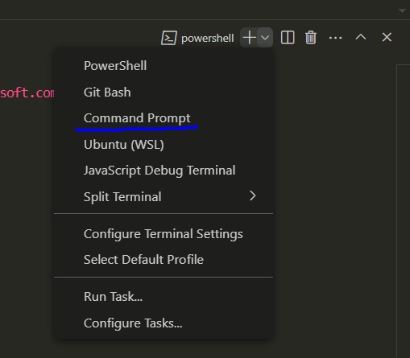

# Flask Setup

## Directory Tree

```
src/
├──client -> using React
    ├── node_modules
    ├── public
        ├── index.html
        ├── robots.txt -> allows web crawlers access to all pages to improve SEO (not necessary for this application but cool thing)
    ├── src
        ├── components
            └── Reuseable UI components
        ├── tests
            └── React test scripts
        ├── App.css
        ├── App.js
        ├── index.css
        ├── index.js
        ├── reportWebVitals.js
    ├── package-lock.json
    ├── package.json
    └── README.md
└──server -> using Flask
    └── app/
        ├── static/
            └── CSS, JavaScript
        ├── templates/
            └── HTML for pages
        ├── __init__.py
        ├── forms.py
        ├── models.py
        ├── views.py
    ├── config.py
    ├── db_create.py
    ├── README.md
    ├── requirements.txt
    └──  run.py
```

**config.py, db_create.py, run.py** - shouldn't really need to change file contents (**init.py** may also fall into this category, as not sure if API support will require changes to this file) \
All shown above are required files - extra files/directories may be created for modularity

### Directory Tidiness Guidelines

When commiting new changes, **DO NOT**

- push the **flask** directory which is created when initialising the flask virtual environment.
- push any **pycache** files which are created when _flask run_ command is called

## First Time Setup

### Flask Setup

After initializing the flask virtual environment, the required dependencies need to be installed. In the same directory where the "flask" dir is located (and by extention, the "src" directory) do:

```bash
pip install -r src/requirements.txt
```

requirements.txt contains all the libraries required for the project. As more libraries are added, to update the requirements.txt, do:

```bash
pip freeze -l > requirements.txt
```

Note: if the pip command doesn't work, try the command below to reinstall pip in the latest version.

```bash
python -m pip install --upgrade pip
```

If it still doesn't work try replace pip with:

```bash
flask/Scripts/pip
```

### React Setup

Need to install Node.js: https://nodejs.org/en

To run the React application we first need to have the flask server up and running. On a Git Bash terminal, (assuming current dir is top level dir) do:

```bash
python3 -m venv flask
source flask/Scripts/activate
cd src/server
flask run
```

Next open a new terminal, this time using the Command Promtp (VSCode powershell terminal does not let you run **npm** commands). In the new terminal we will be running our React front end (assuming current dir is src/server):

```bash
cd ..
cd client
npm start
```

Note: Below is a picture showing how to change terminal types in VSCode.



## Additional Comments - IMPORTANT

Read the App.js, login.jsx and views.py files to understand how react is being used with flask.

I have tried SO INCREDIBLY HARD OH MY GOD LIKE 3 HOURS ON JUST THAT PART, to get the React forms working with CSRF enabled (check config.py), but 0 luck. PLEASE someone else look into it - CSRF should be enabled in any webpage where user inputs are required so that they can't be accessed by malicious users - especially important for payments and things

Further React information on the README in the client directory.

In **package.json**, we have specified the proxy to be http://localhost:5000, to connect the front end to the Flask backend, but this will have to be changed once we deploy application (maybe lol, we will see after figuring out server hosting).

## Basic Commands (for reference)

Creates flask virtual environment and activates it - run the commands in software root directory (i.e. same level as "src" dir). Depending on OS, the **Scripts** folder could be named something different.

```bash
python3 -m venv flask
source flask/Scripts/activate
```

To deactivate the environment:

```bash
source flask/Scripts/deactivate
```

To run the flask application:

```bash
cd src
flask run
```

To create database (will create migrations folder and app.db file, which is where the database can be viewed):

```bash
cd src
flask db init
flask db migrate -m "<comment>"
flask db upgrade
```

**init**: Initialises database (creates migration folder in src dir) \
**migrate**: "commits" changes to db\
**upgrade**: "pushes" changes to db\

## First Time Setup

After initializing the flask virtual environment, the required dependencies need to be installed. In the same directory where the "flask" dir is located (and by extention, the "src" directory) do:

```bash
pip install -r src/requirements.txt
```

requirements.txt contains all the libraries required for the project. As more libraries are added, to update the requirements.txt, do:

```bash
pip freeze -l > requirements.txt
```

Note: if the pip command doesn't work, try the command below to reinstall pip in the latest version.

```bash
python -m pip install --upgrade pip
```

If it still doesn't work try replace pip with:

```bash
flask/Scripts/pip
```
